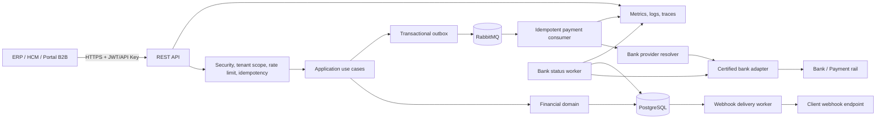
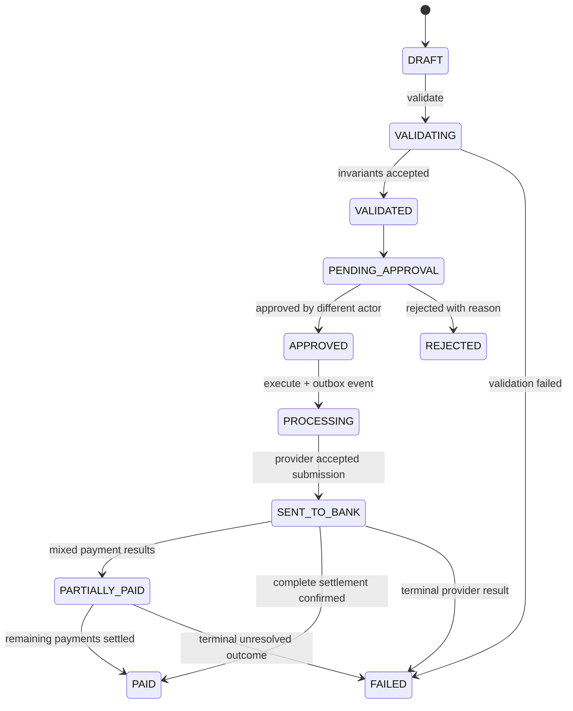

<div align="center">


# Payroll Payment Orchestrator

**Middleware financiero B2B multi-tenant para orquestar pagos masivos de nómina con seguridad, idempotencia, auditoría y conectores bancarios reemplazables.**


</div>

---

## Contenido

- [Descripción](#descripción)
- [Estado real de preparación empresarial](#estado-real-de-preparación-empresarial)
- [Principios de diseño](#principios-de-diseño)
- [Capacidades](#capacidades)
- [Arquitectura](#arquitectura)
- [Módulos](#módulos)
- [Flujo financiero](#flujo-financiero)
- [Consistencia e idempotencia](#consistencia-e-idempotencia)
- [Seguridad](#seguridad)
- [Stack tecnológico](#stack-tecnológico)
- [Estructura del repositorio](#estructura-del-repositorio)
- [Requisitos](#requisitos)
- [Inicio rápido](#inicio-rápido)
- [Configuración inicial de desarrollo](#configuración-inicial-de-desarrollo)
- [Autenticación](#autenticación)
- [Uso de la API](#uso-de-la-api)
- [Endpoints principales](#endpoints-principales)
- [Integraciones bancarias](#integraciones-bancarias)
- [Webhooks](#webhooks)
- [Configuración por ambientes](#configuración-por-ambientes)
- [Variables de entorno](#variables-de-entorno)
- [Observabilidad](#observabilidad)
- [Persistencia y migraciones](#persistencia-y-migraciones)
- [Pruebas y quality gates](#pruebas-y-quality-gates)
- [Docker](#docker)
- [Kubernetes y Azure](#kubernetes-y-azure)
- [CI/CD y cadena de suministro](#cicd-y-cadena-de-suministro)
- [Operación, SLO y recuperación](#operación-slo-y-recuperación)
- [Proceso de go-live](#proceso-de-go-live)
- [Solución de problemas](#solución-de-problemas)
- [Límites y responsabilidades externas](#límites-y-responsabilidades-externas)
- [Documentación complementaria](#documentación-complementaria)

---

## Descripción

**Payroll Payment Orchestrator** es un backend financiero B2B diseñado para recibir, validar, aprobar, ejecutar, monitorear y conciliar lotes de nómina empresariales mediante API REST.

La solución actúa como capa de orquestación entre sistemas empresariales —ERP, HCM, portales administrativos o integraciones internas— y proveedores bancarios heterogéneos. Su función no es reemplazar al banco ni simular una certificación inexistente, sino ofrecer un núcleo financiero estable con:

- dominio de nómina explícito;
- segregación de funciones;
- aislamiento por tenant y empresa;
- idempotencia en API, mensajería y envío bancario;
- ejecución asíncrona confiable;
- auditoría técnica y financiera;
- conectores bancarios intercambiables;
- conciliación y resultados por pago;
- observabilidad y controles operativos;
- despliegue reproducible sobre Java 21.

El sistema está implementado como **monolito modular con frontera hexagonal alrededor del core financiero**. Esta decisión mantiene transacciones fuertes y reduce complejidad operacional, sin impedir que módulos específicos sean extraídos en el futuro.

---

## Estado real de preparación empresarial

| Capacidad | Estado |
|---|---|
| Despliegue empresarial en modo restringido | **Disponible** |
| Creación, validación y aprobación de lotes | **Disponible** |
| Multi-tenancy y autorización por recurso | **Disponible** |
| Outbox, inbox, retry y DLQ | **Disponible** |
| Auditoría, trazabilidad y correlación | **Disponible** |
| Webhooks firmados y reintentables | **Disponible** |
| Ejecución local con proveedor sandbox | **Disponible solo en `dev/test`** |
| Adaptador HTTP genérico | **Referencia técnica, no certificada** |
| Movimiento de dinero en producción | **Bloqueado por defecto** |
| Integración con un banco real | **Requiere adaptador dedicado y homologación** |
| Certificación regulatoria o bancaria | **No incluida** |

> [!IMPORTANT]
> El proyecto puede desplegarse en empresas en **restricted mode** para configuración, integración, auditoría, pruebas, staging y homologación. La ejecución monetaria productiva solo debe habilitarse cuando exista un proveedor bancario dedicado, incluido en la lista de proveedores certificados y respaldado por evidencia de homologación.

El repositorio no afirma cumplimiento automático de PCI DSS, ISO 27001, SOC 2, SARLAFT, normas de una superintendencia ni certificaciones equivalentes. Esas acreditaciones requieren controles organizacionales, infraestructura, evidencias, auditorías y alcance formal más allá del código fuente.

---

## Principios de diseño

1. **No interpretar aceptación técnica como pago liquidado.**
2. **No mezclar protocolo bancario con controladores REST.**
3. **No confiar en UUID como mecanismo de autorización.**
4. **No almacenar secretos operativos en código o archivos versionados.**
5. **No publicar mensajes financieros fuera de un patrón outbox.**
6. **No ejecutar dos veces una instrucción por redelivery o reintento.**
7. **No habilitar conectores no certificados en producción.**
8. **No perder evidencia ante fallos parciales.**
9. **No depender de un único nodo para locks o schedulers.**
10. **No considerar un build exitoso como aprobación de go-live.**

---

## Capacidades

### Dominio financiero

- Lotes de nómina con hasta 10.000 pagos por solicitud.
- Invariantes monetarias y de moneda.
- Máquina de estados explícita.
- Resultado individual por beneficiario.
- Estados parciales, rechazos, devoluciones y fallos terminales.
- Maker-checker básico: el creador no puede aprobar el mismo lote.
- Optimistic locking sobre el agregado.
- Historial persistente de transiciones.
- Enmascaramiento de documento y cuenta en respuestas REST.

### Multi-tenancy e IAM

- Tenants y empresas como fronteras de acceso.
- Usuarios y clientes API.
- Roles, permisos y scopes.
- JWT con contexto de actor, tenant y empresa.
- Autorización por método y validación adicional de propiedad.
- Credenciales de cliente almacenadas como hash.

### Confiabilidad

- Idempotencia HTTP persistida en PostgreSQL.
- Transactional outbox.
- Consumer inbox.
- Publisher confirms.
- Retry y dead-letter queue.
- Leasing y `FOR UPDATE SKIP LOCKED` para ejecución multinodo.
- Clave idempotente estable para el banco.
- Recuperación de locks y entregas estancadas.

### Integración bancaria

- Puerto `BankPaymentProvider` independiente del protocolo.
- Resolución dinámica por tenant, empresa, cuenta y banco.
- Perfiles bancarios persistidos.
- Referencias de credenciales externas.
- Submission y external reference persistentes.
- Polling de estado coordinado.
- Capabilities por proveedor.
- Adaptador `SANDBOX` para desarrollo y pruebas.
- Adaptador `REST_GENERIC` como referencia no productiva.

### Auditoría y operación

- Correlation ID end-to-end.
- Auditoría con actor, tipo, tenant, empresa, IP y resultado.
- Métricas técnicas y financieras.
- Health, liveness y readiness probes.
- Logs estructurados.
- Prometheus y OpenTelemetry.
- Runbooks, SLO, backup/DR y checklist de go-live.

---

## Arquitectura



### Regla de dependencias

```text
presentation ──────→ application ──────→ domain
                           ↑
infrastructure ────────────┘
```

El dominio financiero no depende de Spring, JPA, RabbitMQ, HTTP ni implementaciones bancarias. ArchUnit protege esta regla sobre el core.

---

## Módulos

| Módulo | Responsabilidad |
|---|---|
| `payroll` | Agregado de lote, pagos, comandos, casos de uso y estados |
| `payments` | Consumo idempotente de comandos de ejecución |
| `banks` | Conexiones, resolución de adaptadores, submission y polling |
| `companies` | Empresas y cuentas bancarias de origen |
| `tenants` | Aislamiento organizacional |
| `iam` | Usuarios, clientes API, roles, permisos y autenticación |
| `idempotency` | Replay seguro y exclusión de comandos HTTP duplicados |
| `audit` | Evidencia técnica, operativa y financiera |
| `reconciliation` | Comparación entre ledger interno y evidencia bancaria |
| `webhooks` | Registro, firma, entrega y reintentos |
| `shared.messaging` | Outbox, inbox y topología RabbitMQ |
| `observability` | Métricas de infraestructura y negocio |
| `shared` | Seguridad, criptografía, filtros, errores y utilidades |

---

## Flujo financiero



### Significado de los estados críticos

| Estado | Significado |
|---|---|
| `PROCESSING` | La ejecución fue aceptada internamente y existe evidencia durable para continuar |
| `SENT_TO_BANK` | El proveedor confirmó recepción o aceptación técnica |
| `PARTIALLY_PAID` | Existen resultados mixtos o liquidación parcial |
| `PAID` | Existe confirmación normalizada de liquidación completa |
| `FAILED` | Se alcanzó un resultado terminal o se agotó la política de consulta |

`PAID` nunca debe derivarse de un simple HTTP 2xx del proveedor.

---

## Consistencia e idempotencia

La solución usa barreras separadas para distintos tipos de duplicación:

1. **Idempotencia HTTP**  
   Clave + endpoint + principal + tenant/empresa + hash del payload.

2. **Optimistic y pessimistic locking**  
   Protege transiciones del agregado y operaciones con exclusión.

3. **Transactional outbox**  
   Persiste el evento en la misma transacción del cambio financiero.

4. **Consumer inbox**  
   Absorbe redeliveries de RabbitMQ.

5. **Submission única**  
   Evita crear varias ejecuciones bancarias para el mismo `executionId`.

6. **Bank idempotency key**  
   El adaptador transmite una clave estable al proveedor cuando el contrato lo permite.

### Headers relevantes

| Header | Uso |
|---|---|
| `Authorization: Bearer <token>` | Autenticación JWT |
| `Authorization: ApiKey <clientId>.<secret>` | Autenticación directa de cliente API |
| `X-API-KEY: <clientId>.<secret>` | Alternativa de API key |
| `Idempotency-Key` | Obligatorio en operaciones mutables, excepto autenticación |
| `X-Correlation-Id` | Correlación cliente-servidor; se genera si no se envía |
| `Idempotent-Replayed: true` | La respuesta fue recuperada del almacén idempotente |

La clave idempotente debe contener entre 8 y 120 caracteres seguros: letras, números, punto, guion, guion bajo o dos puntos.

---

## Seguridad

### Controles implementados

- Sesiones stateless.
- JWT firmado con HMAC y claims `iss`, `aud`, `iat`, `nbf`, `exp`, `jti`.
- Contexto de actor, tenant, empresa y administrador de plataforma.
- Autorización mediante scopes y `@PreAuthorize`.
- Validación adicional de pertenencia de recursos.
- Contraseñas y secretos de API client almacenados con `PasswordEncoder`.
- AES-GCM con nonce aleatorio para datos sensibles.
- HMAC-SHA256 separado para búsquedas deterministas e integridad.
- Lectura dual para rotación de clave de cifrado.
- Documento y cuenta enmascarados en responses.
- Errores sin stack trace ni mensajes internos.
- mTLS entrante configurable.
- IP allowlist compatible con proxies explícitamente confiables.
- Rate limiting sin bloqueo artificial de threads.
- Política SSRF para bancos y webhooks.
- HTTPS obligatorio y redes privadas bloqueadas en staging/producción.
- Redirects HTTP deshabilitados en salidas críticas.
- Swagger deshabilitado en producción.
- Bootstrap administrativo deshabilitado por defecto.
- Validación fail-fast de secretos y políticas de go-live.

### Gestión de secretos

Nunca versionar:

- `.env`;
- claves JWT;
- claves AES/HMAC;
- contraseñas de PostgreSQL o RabbitMQ;
- certificados privados;
- tokens bancarios;
- secretos de webhooks.

En staging y producción deben usarse Azure Key Vault, HashiCorp Vault, un KMS/HSM o un servicio equivalente. Las conexiones bancarias soportan referencias externas:

```text
env:BANK_ACME_API_TOKEN
```

La variable referenciada se inyecta en runtime y el valor no se devuelve por la API.

### Rotación de cifrado

1. Mover la clave activa a `APP_PREVIOUS_ENCRYPTION_KEY`.
2. Generar una nueva `APP_ENCRYPTION_KEY` independiente.
3. Desplegar lectura dual.
4. Re-cifrar registros en lotes auditados.
5. Validar descifrado y conteos.
6. Retirar la clave anterior únicamente cuando ningún ciphertext dependa de ella.

Consulte [`docs/SECURITY.md`](docs/SECURITY.md).

---

## Stack tecnológico

| Capa | Tecnología |
|---|---|
| Lenguaje | Java 21 |
| Framework | Spring Boot 4.0.7 |
| API | Spring Web MVC + Bean Validation |
| Seguridad | Spring Security, JWT, API keys, mTLS/IP policies |
| Persistencia | Spring Data JPA + PostgreSQL 16 |
| Migraciones | Flyway V1–V13 |
| Mensajería | RabbitMQ 4 + Spring AMQP |
| Documentación API | springdoc-openapi 3.0.3 |
| Métricas | Micrometer + Prometheus |
| Trazas | Micrometer Tracing + OpenTelemetry OTLP |
| Pruebas | JUnit 5, Mockito, Spring Security Test, Testcontainers |
| Arquitectura | ArchUnit |
| Cobertura | JaCoCo |
| SBOM | CycloneDX |
| Contenedores | Docker multi-stage, runtime no-root |
| Orquestación | Kubernetes/Kustomize, overlay Azure/AKS |
| CI/CD | GitHub Actions, escaneo, firma y provenance |

---

## Estructura del repositorio

```text
.
├── .github/workflows/                 # CI, seguridad y releases
├── deploy/kubernetes/                 # Base Kustomize y overlay Azure
├── docs/
│   ├── adr/                           # Architecture Decision Records
│   ├── api/                           # Requests de ejemplo
│   ├── integration/                   # Guía y checklist bancario
│   └── operations/                    # Runbooks, SLO, DR y go-live
├── scripts/                           # Secrets locales, preflight y quality gate
├── src/main/java/.../
│   ├── audit/
│   ├── banks/
│   ├── companies/
│   ├── iam/
│   ├── idempotency/
│   ├── observability/
│   ├── payments/
│   ├── payroll/
│   ├── reconciliation/
│   ├── shared/
│   ├── tenants/
│   └── webhooks/
├── src/main/resources/
│   ├── application.yml
│   ├── application-dev.yml
│   ├── application-staging.yml
│   ├── application-prod.yml
│   └── db/migration/                  # Flyway V1–V13
├── src/test/java/                     # Unit, architecture, security, contracts, smoke
├── .env.example
├── compose.yaml
├── Dockerfile
├── mvnw / mvnw.cmd
└── pom.xml
```

---

## Requisitos

### Desarrollo local

- JDK 21 recomendado.
- Maven 3.9+ o Maven Wrapper incluido.
- Docker Engine.
- Docker Compose v2.
- Git.

### Quality gate reproducible

El gate autoritativo utiliza Docker con Temurin 21, por lo que no depende del JDK instalado en el host:

```bash
./scripts/verify-enterprise.sh
```

```powershell
.\scripts\verify-enterprise.ps1
```

---

## Inicio rápido

### Linux/macOS

```bash
cp .env.example .env
./scripts/generate-local-secrets.sh > .env
docker compose up --build -d
docker compose logs -f payroll-backend
```

### Windows PowerShell

```powershell
Copy-Item .env.example .env
.\scripts\generate-local-secrets.ps1 | Set-Content -Encoding utf8 .env
docker compose up --build -d
docker compose logs -f payroll-backend
```

### Verificar servicios

```bash
curl http://localhost:8080/api/v1/health
curl http://localhost:8080/actuator/health
```

Servicios locales:

| Servicio | URL |
|---|---|
| API | `http://localhost:8080` |
| Swagger UI | `http://localhost:8080/swagger-ui.html` |
| OpenAPI | `http://localhost:8080/v3/api-docs` |
| RabbitMQ Management | `http://localhost:15672` |
| Health | `http://localhost:8080/actuator/health` |
| Prometheus | `http://localhost:8080/actuator/prometheus` |

> [!NOTE]
> Swagger está disponible únicamente en desarrollo. El perfil `prod` lo deshabilita de forma explícita.

---

## Configuración inicial de desarrollo

El bootstrap está deshabilitado por defecto. Para crear el primer administrador local, agregue temporalmente a `.env`:

```dotenv
APP_BOOTSTRAP_ENABLED=true
APP_BOOTSTRAP_ADMIN_EMAIL=admin@local.test
APP_BOOTSTRAP_ADMIN_PASSWORD=Use-A-Unique-Local-Password-2026!
```

Reinicie el backend:

```bash
docker compose up --build -d payroll-backend
```

Después de confirmar el usuario, vuelva a:

```dotenv
APP_BOOTSTRAP_ENABLED=false
```

El bootstrap crea permisos, roles base y un administrador de plataforma. Está prohibido en producción por la validación de configuración.

### Roles base

| Rol | Permisos principales |
|---|---|
| `ADMIN` | Todos los permisos registrados |
| `AUDITOR` | `audit:read`, `payroll:read` |
| `PAYROLL_OPERATOR` | `payroll:create`, `payroll:read` |
| `APPROVER` | `payroll:read`, `payroll:approve` |
| `BANK_OPERATOR` | `bank:manage`, `reconciliation:manage`, `payroll:read` |

### Permisos disponibles

```text
iam:manage
iam:read
tenant:manage
company:manage
payroll:create
payroll:read
payroll:approve
payroll:execute
audit:read
webhook:manage
bank:manage
reconciliation:manage
```

---

## Autenticación

### Login de usuario

```bash
curl -X POST http://localhost:8080/api/v1/auth/login \
  -H 'Content-Type: application/json' \
  -d '{
    "email": "admin@local.test",
    "password": "Use-A-Unique-Local-Password-2026!"
  }'
```

Respuesta:

```json
{
  "success": true,
  "data": {
    "tokenType": "Bearer",
    "accessToken": "<jwt>",
    "expiresInSeconds": 3600,
    "authorities": ["tenant:manage", "company:manage"]
  },
  "error": null,
  "meta": {
    "timestamp": "2026-08-06T20:00:00Z"
  }
}
```

### Client credentials

```bash
curl -X POST http://localhost:8080/api/v1/oauth/token \
  -H 'Content-Type: application/json' \
  -d '{
    "grantType": "client_credentials",
    "clientId": "<client-id>",
    "clientSecret": "<client-secret>"
  }'
```

El secreto del cliente API se muestra una sola vez al crear el cliente. Debe almacenarse inmediatamente en un gestor de secretos.

### API key directa

```http
Authorization: ApiKey <clientId>.<clientSecret>
```

También puede enviarse:

```http
X-API-KEY: <clientId>.<clientSecret>
```

Para integraciones sostenidas se recomienda intercambiar las credenciales por un JWT mediante `/oauth/token`, reduciendo la exposición del secreto principal.

---

## Uso de la API

Todas las operaciones mutables protegidas requieren:

```http
Authorization: Bearer <token>
Idempotency-Key: payroll-create-2026-08-001
X-Correlation-Id: erp-run-2026-08-001
Content-Type: application/json
```

### Crear tenant

```bash
curl -X POST http://localhost:8080/api/v1/tenants \
  -H "Authorization: Bearer $TOKEN" \
  -H 'Idempotency-Key: tenant-acme-001' \
  -H 'Content-Type: application/json' \
  -d '{
    "name": "ACME Colombia",
    "slug": "acme-colombia"
  }'
```

### Crear empresa

```bash
curl -X POST http://localhost:8080/api/v1/companies \
  -H "Authorization: Bearer $TOKEN" \
  -H 'Idempotency-Key: company-acme-001' \
  -H 'Content-Type: application/json' \
  -d '{
    "tenantId": "<tenant-uuid>",
    "legalName": "ACME Colombia S.A.S.",
    "taxId": "900123456-7",
    "currency": "COP"
  }'
```

### Registrar cuenta de origen

```bash
curl -X POST http://localhost:8080/api/v1/companies/<company-uuid>/bank-accounts \
  -H "Authorization: Bearer $TOKEN" \
  -H 'Idempotency-Key: source-account-001' \
  -H 'Content-Type: application/json' \
  -d '{
    "bankCode": "BANK_ACME",
    "accountType": "CHECKING",
    "accountNumber": "123456789012"
  }'
```

La respuesta devuelve únicamente la cuenta enmascarada y sus últimos cuatro dígitos.

### Crear lote de nómina

```bash
curl -X POST http://localhost:8080/api/v1/payroll-batches \
  -H "Authorization: Bearer $TOKEN" \
  -H 'Idempotency-Key: payroll-2026-08-001' \
  -H 'X-Correlation-Id: erp-payroll-2026-08-001' \
  -H 'Content-Type: application/json' \
  -d '{
    "companyId": "<company-uuid>",
    "sourceAccountId": "<source-account-uuid>",
    "currency": "COP",
    "scheduledDate": "2026-08-15",
    "payments": [
      {
        "employeeDocumentType": "CC",
        "employeeDocumentNumber": "1000000001",
        "employeeFullName": "Empleado de Ejemplo",
        "bankCode": "BANK_ACME",
        "accountType": "SAVINGS",
        "accountNumber": "9876543210",
        "amount": 2500000.00
      }
    ]
  }'
```

### Validar, aprobar y ejecutar

```bash
curl -X POST http://localhost:8080/api/v1/payroll-batches/<batch-uuid>/validate \
  -H "Authorization: Bearer $TOKEN" \
  -H 'Idempotency-Key: payroll-validate-001'
```

```bash
curl -X POST http://localhost:8080/api/v1/payroll-batches/<batch-uuid>/approve \
  -H "Authorization: Bearer $APPROVER_TOKEN" \
  -H 'Idempotency-Key: payroll-approve-001'
```

```bash
curl -X POST http://localhost:8080/api/v1/payroll-batches/<batch-uuid>/execute \
  -H "Authorization: Bearer $EXECUTOR_TOKEN" \
  -H 'Idempotency-Key: payroll-execute-001'
```

`execute` devuelve HTTP `202 Accepted`. La ejecución bancaria continúa de forma asíncrona mediante outbox, RabbitMQ, inbox y el proveedor configurado.

### Envelope estándar

Éxito:

```json
{
  "success": true,
  "data": {},
  "error": null,
  "meta": {
    "timestamp": "2026-08-06T20:00:00Z"
  }
}
```

Error:

```json
{
  "success": false,
  "data": null,
  "error": {
    "code": "ACCESS_DENIED",
    "message": "The authenticated principal is not authorized for this operation",
    "details": []
  },
  "meta": {
    "timestamp": "2026-08-06T20:00:00Z"
  }
}
```

---

## Endpoints principales

Base path: `/api/v1`

| Método | Endpoint | Permiso / acceso |
|---|---|---|
| `GET` | `/health` | Público |
| `POST` | `/auth/login` | Público |
| `POST` | `/oauth/token` | Público |
| `POST` | `/tenants` | `tenant:manage` |
| `GET` | `/tenants` | `tenant:manage` |
| `GET` | `/tenants/{tenantId}` | `tenant:manage` |
| `POST` | `/companies` | `company:manage` |
| `GET` | `/companies` | `company:manage` o `payroll:read` |
| `GET` | `/companies/{companyId}` | `company:manage` o `payroll:read` |
| `POST` | `/companies/{companyId}/bank-accounts` | `company:manage` |
| `GET` | `/companies/{companyId}/bank-accounts` | `company:manage` o `payroll:read` |
| `POST` | `/iam/users` | `iam:manage` |
| `GET` | `/iam/users` | `iam:read` |
| `POST` | `/iam/api-clients` | `iam:manage` |
| `POST` | `/bank-connections` | `bank:manage` |
| `POST` | `/payroll-batches` | `payroll:create` |
| `GET` | `/payroll-batches` | `payroll:read` |
| `GET` | `/payroll-batches/{batchId}` | `payroll:read` |
| `POST` | `/payroll-batches/{batchId}/validate` | `payroll:create` |
| `POST` | `/payroll-batches/{batchId}/approve` | `payroll:approve` |
| `POST` | `/payroll-batches/{batchId}/reject` | `payroll:approve` |
| `POST` | `/payroll-batches/{batchId}/execute` | `payroll:execute` |
| `POST` | `/payroll-batches/{batchId}/reconciliation` | `reconciliation:manage` |
| `GET` | `/payroll-batches/{batchId}/reconciliation` | `payroll:read` |
| `GET` | `/audit-logs` | `audit:read` |
| `POST` | `/companies/{companyId}/webhooks` | `webhook:manage` |
| `GET` | `/companies/{companyId}/webhooks` | `webhook:manage` |
| `POST` | `/companies/{companyId}/webhooks/{webhookId}/disable` | `webhook:manage` |

La especificación OpenAPI de desarrollo es la fuente más precisa para schemas y validaciones.

---

## Integraciones bancarias

### Puerto estable

```java
public interface BankPaymentProvider {
    String providerKey();
    BankSubmissionResult submitPayrollBatch(BankSubmissionCommand command);
    BankPaymentStatusResult getBatchStatus(BankStatusQuery query);
    BankPaymentStatusResult getPaymentStatus(BankPaymentStatusQuery query);
    BankReconciliationResult reconcile(BankReconciliationCommand command);
    BankCapabilities getCapabilities();
}
```

### Resolución del proveedor

```text
tenant
  → company
    → source account
      → bank code
        → active bank connection
          → provider key
            → provider registry
              → concrete adapter
```

### Crear conexión en desarrollo con sandbox

```bash
curl -X POST http://localhost:8080/api/v1/bank-connections \
  -H "Authorization: Bearer $TOKEN" \
  -H 'Idempotency-Key: bank-connection-sandbox-001' \
  -H 'Content-Type: application/json' \
  -d '{
    "companyId": "<company-uuid>",
    "bankCode": "BANK_ACME",
    "providerKey": "SANDBOX",
    "environment": "sandbox",
    "connectTimeoutMs": 3000,
    "readTimeoutMs": 10000
  }'
```

### Configuración productiva esperada

```json
{
  "companyId": "<company-uuid>",
  "bankCode": "BANK_ACME",
  "providerKey": "BANK_ACME_V1",
  "environment": "production",
  "baseUrl": "https://api.bank.example.com",
  "credentialReference": "env:BANK_ACME_API_TOKEN",
  "connectTimeoutMs": 3000,
  "readTimeoutMs": 15000
}
```

### Requisitos de un adaptador productivo

- Contrato técnico oficial del banco.
- Identificador idempotente soportado o estrategia equivalente.
- mTLS saliente y truststore conforme al banco.
- Firma de mensajes si aplica.
- Timeouts explícitos.
- Clasificación de errores retryable y terminal.
- Normalización de estados.
- Parsing estricto de schemas.
- Métricas y trazas sin secretos ni PII.
- Contract tests.
- Pruebas de timeout después de recepción.
- Pruebas de duplicidad y liquidación parcial.
- Conciliación y devoluciones.
- Runbook y propietario operativo.
- Evidencia de homologación.

`REST_GENERIC` y `SANDBOX` no pueden formar parte de `APP_BANK_CERTIFIED_PROVIDERS` en producción.

Consulte:

- [`docs/integration/BANK_ADAPTER_GUIDE.md`](docs/integration/BANK_ADAPTER_GUIDE.md)
- [`docs/integration/BANK_CERTIFICATION_CHECKLIST.md`](docs/integration/BANK_CERTIFICATION_CHECKLIST.md)

---

## Webhooks

Los endpoints registrados reciben eventos persistidos y reintentables.

### Headers enviados

```http
Content-Type: application/json
User-Agent: Payroll-Payment-Orchestrator-Webhook/1.0
X-Webhook-Id: <event-uuid>
X-Webhook-Event: <event-name>
X-Webhook-Timestamp: <unix-seconds>
X-Webhook-Signature: sha256=<hex-hmac>
```

### Cálculo de firma

```text
signedPayload = timestamp + "." + rawRequestBody
signature = "sha256=" + hex(HMAC_SHA256(secret, signedPayload))
```

El consumidor debe:

1. Leer el body como bytes sin modificarlo.
2. Verificar la tolerancia temporal del timestamp.
3. Calcular la firma con comparación de tiempo constante.
4. Rechazar IDs de evento ya procesados.
5. Responder 2xx solo después de persistir el evento.

El secreto se devuelve únicamente al crear el webhook. Las consultas posteriores no lo muestran.

---

## Configuración por ambientes

| Perfil | Uso | Swagger | Sandbox | Ejecución monetaria |
|---|---|---|---|---|
| `dev` | Desarrollo local | Habilitado | Permitido | Configurable |
| `test` | Pruebas automatizadas | No requerido | Permitido | Controlado por prueba |
| `staging` | Homologación y preproducción | Deshabilitado por defecto | No fallback | Deshabilitada por defecto |
| `prod` | Producción | Deshabilitado | Prohibido | Deshabilitada por defecto |

### Restricted mode

```dotenv
APP_PAYMENT_EXECUTION_ENABLED=false
```

Permite administrar configuración, preparar y aprobar lotes, consultar información, auditar, conciliar y monitorear. Bloquea nuevas ejecuciones monetarias.

### Payment-enabled mode

```dotenv
APP_PAYMENT_EXECUTION_ENABLED=true
APP_BANK_ALLOW_UNCERTIFIED_PROVIDERS=false
APP_BANK_SANDBOX_FALLBACK_ENABLED=false
APP_BANK_CERTIFIED_PROVIDERS=BANK_ACME_V1
```

La aplicación debe fallar al iniciar si la política de proveedores o secretos no cumple los controles exigidos.

---

## Variables de entorno

### Infraestructura

| Variable | Requerida | Descripción |
|---|---:|---|
| `SPRING_PROFILES_ACTIVE` | Sí fuera de local | `dev`, `staging` o `prod` |
| `SPRING_DATASOURCE_URL` | Sí | JDBC URL de PostgreSQL |
| `SPRING_DATASOURCE_USERNAME` | Sí | Usuario de base de datos |
| `SPRING_DATASOURCE_PASSWORD` | Sí | Contraseña de base de datos |
| `SPRING_DATASOURCE_MAX_POOL_SIZE` | No | Máximo del pool Hikari |
| `SPRING_DATASOURCE_MIN_IDLE` | No | Conexiones mínimas inactivas |
| `SPRING_RABBITMQ_HOST` | Sí | Host RabbitMQ |
| `SPRING_RABBITMQ_PORT` | No | Puerto AMQP, default `5672` |
| `SPRING_RABBITMQ_USERNAME` | Sí | Usuario RabbitMQ |
| `SPRING_RABBITMQ_PASSWORD` | Sí | Contraseña RabbitMQ |
| `SPRING_RABBITMQ_VIRTUAL_HOST` | No | Virtual host, default `/` |
| `SERVER_PORT` | No | Puerto HTTP, default `8080` |

### Seguridad y criptografía

| Variable | Requerida | Descripción |
|---|---:|---|
| `APP_JWT_SECRET` | Sí | Secreto JWT, mínimo 32 bytes efectivos |
| `APP_JWT_ISSUER` | No | Issuer esperado |
| `APP_JWT_AUDIENCE` | No | Audience esperado |
| `APP_JWT_EXPIRATION_MINUTES` | No | Vigencia del token |
| `APP_JWT_CLOCK_SKEW_SECONDS` | No | Tolerancia de reloj |
| `APP_ENCRYPTION_KEY` | Sí | Clave AES-GCM activa |
| `APP_PREVIOUS_ENCRYPTION_KEY` | Durante rotación | Clave anterior para lectura dual |
| `APP_HASH_KEY` | Sí | Clave HMAC independiente |
| `APP_REQUIRE_IDEMPOTENCY_KEY` | No | Exige idempotencia en mutaciones |
| `APP_IP_ALLOWLIST_ENABLED` | Según ambiente | Activa allowlist IP |
| `APP_IP_ALLOWLIST` | Si está activa | IP/CIDR autorizados |
| `APP_TRUSTED_PROXY_ADDRESSES` | Con proxy | Proxies autorizados para forwarded headers |
| `APP_MTLS_ENABLED` | Según arquitectura | Activa validación de certificado cliente |
| `APP_MTLS_ALLOWED_SUBJECTS` | Si mTLS está activo | Subjects/SAN permitidos |
| `APP_RATE_LIMIT_REQUESTS` | No | Límite por ventana |
| `APP_RATE_LIMIT_WINDOW_SECONDS` | No | Duración de la ventana |

### Gobierno de ejecución bancaria

| Variable | Default seguro | Descripción |
|---|---:|---|
| `APP_PAYMENT_EXECUTION_ENABLED` | `false` | Habilita nuevas ejecuciones monetarias |
| `APP_BANK_SANDBOX_FALLBACK_ENABLED` | `false` base/prod | Permite fallback sandbox únicamente en desarrollo |
| `APP_BANK_ALLOW_UNCERTIFIED_PROVIDERS` | `false` | Permite proveedores no certificados |
| `APP_BANK_CERTIFIED_PROVIDERS` | Vacío | Allowlist de provider keys certificados |
| `APP_BANK_STATUS_POLL_DELAY_MS` | `30000` | Primer polling |
| `APP_BANK_STATUS_POLL_FIXED_DELAY_MS` | `15000` | Frecuencia del worker |
| `APP_BANK_STATUS_POLL_LEASE_MS` | `360000` | Lease distribuido |
| `APP_BANK_MAX_STATUS_POLL_ATTEMPTS` | `120` | Máximo de consultas |

### Mensajería, idempotencia y webhooks

| Variable | Default | Descripción |
|---|---:|---|
| `APP_OUTBOX_FIXED_DELAY_MS` | `1000` | Frecuencia del dispatcher |
| `APP_OUTBOX_BATCH_SIZE` | `50` | Eventos por lote |
| `APP_OUTBOX_MAX_PUBLISH_ATTEMPTS` | `10` | Intentos antes de estado terminal |
| `APP_IDEMPOTENCY_LOCK_LEASE_SECONDS` | `300` | Recuperación de lock |
| `APP_IDEMPOTENCY_CLEANUP_FIXED_DELAY_MS` | `3600000` | Limpieza de expirados |
| `APP_WEBHOOK_RETRY_FIXED_DELAY_MS` | `60000` | Frecuencia de reintento |
| `APP_WEBHOOK_MAX_ATTEMPTS` | `5` | Máximo de entregas |
| `APP_WEBHOOK_CONNECT_TIMEOUT_MS` | `5000` | Timeout de conexión |
| `APP_WEBHOOK_READ_TIMEOUT_MS` | `15000` | Timeout total de respuesta |
| `APP_WEBHOOK_SENDING_LEASE_MS` | `120000` | Recuperación de entregas estancadas |

### Perímetro y observabilidad

| Variable | Requerida | Descripción |
|---|---:|---|
| `APP_OUTBOUND_ALLOWED_HOSTS` | Sí en staging/prod | FQDN exactos de bancos y webhooks |
| `APP_OUTBOUND_ALLOW_HTTP` | Debe ser `false` en prod | Permite HTTP sin TLS |
| `APP_OUTBOUND_ALLOW_PRIVATE_NETWORKS` | Debe ser `false` en prod | Permite destinos privados |
| `MANAGEMENT_TRACING_SAMPLING_PROBABILITY` | No | Probabilidad de sampling |
| `OTEL_EXPORTER_OTLP_ENDPOINT` | Si se exportan trazas | Collector OpenTelemetry |
| `SPRINGDOC_ENABLED` | No | OpenAPI/Swagger fuera de `dev` |

### Bootstrap local

| Variable | Uso |
|---|---|
| `APP_BOOTSTRAP_ENABLED` | Solo temporalmente en desarrollo |
| `APP_BOOTSTRAP_ADMIN_EMAIL` | Email del administrador inicial |
| `APP_BOOTSTRAP_ADMIN_PASSWORD` | Contraseña mínima de 16 caracteres |

---

## Observabilidad

### Endpoints Actuator

| Endpoint | Propósito |
|---|---|
| `/actuator/health` | Salud agregada |
| `/actuator/health/liveness` | Proceso vivo |
| `/actuator/health/readiness` | Dependencias listas |
| `/actuator/info` | Build info |
| `/actuator/metrics` | Catálogo de métricas |
| `/actuator/prometheus` | Scrape Prometheus |

### Dimensiones operativas

La solución expone o prepara métricas para:

- latencia y errores HTTP;
- disponibilidad;
- pool PostgreSQL;
- conectividad RabbitMQ;
- backlog de outbox;
- inbox fallido o estancado;
- submissions bancarias pendientes;
- polling agotado;
- entregas webhook pendientes/fallidas;
- resultados financieros por estado.

### Correlación

`X-Correlation-Id` se propaga por:

```text
HTTP → aplicación → outbox → RabbitMQ → inbox → adaptador bancario → auditoría
```

Los logs incluyen `correlationId` y el perfil staging/prod usa formato estructurado ECS.

No se deben registrar:

- tokens;
- secretos;
- cuentas completas;
- documentos completos;
- payloads bancarios completos;
- credenciales de conexión.

---

## Persistencia y migraciones

PostgreSQL es la fuente de verdad financiera. RabbitMQ no reemplaza el ledger.

- Hibernate usa `ddl-auto: validate`.
- Flyway controla el esquema.
- Las migraciones existentes no deben editarse después de publicarse.
- Nuevos cambios deben añadirse como una versión posterior.
- Staging debe validar migraciones contra un snapshot representativo.
- Producción debe contar con PITR y restore probado.

La distribución contiene migraciones **V1–V13**, incluyendo:

- tenants, empresas y cuentas;
- IAM, roles y permisos;
- auditoría y webhooks;
- historial de estados;
- tenant hardening y optimistic locking;
- submissions bancarias;
- outbox e inbox;
- confiabilidad de webhooks;
- integridad de conciliación;
- leases de idempotencia;
- referencias externas de secretos;
- índices operativos.

Consulte [`docs/operations/MIGRATION_GUIDE.md`](docs/operations/MIGRATION_GUIDE.md).

---

## Pruebas y quality gates

### Suite incluida

- Pruebas unitarias del dominio.
- Casos de uso de nómina.
- Idempotencia.
- Auditoría.
- Criptografía y JWT.
- Tenant/resource access.
- Política de ejecución monetaria.
- Gobierno de proveedores.
- Contract test del sandbox.
- ArchUnit.
- Smoke test con PostgreSQL y RabbitMQ mediante Testcontainers.

### Gate Maven

```bash
./mvnw -B -ntp clean verify
```

Windows:

```powershell
.\mvnw.cmd -B -ntp clean verify
```

### Gate reproducible empresarial

```bash
./scripts/verify-enterprise.sh
```

```powershell
.\scripts\verify-enterprise.ps1
```

Este gate construye la imagen con Temurin 21, ejecuta el build Maven y produce un runtime no-root.

### Artefactos generados

- JAR ejecutable.
- Reportes de pruebas.
- Reporte JaCoCo.
- SBOM CycloneDX.
- Imagen OCI.

---

## Docker

### Construir

```bash
docker build --pull -t payroll-payment-orchestrator:local .
```

### Ejecutar

```bash
docker run --rm -p 8080:8080 \
  -e SPRING_PROFILES_ACTIVE=prod \
  -e SPRING_DATASOURCE_URL='jdbc:postgresql://host:5432/payroll' \
  -e SPRING_DATASOURCE_USERNAME='payroll_app' \
  -e SPRING_DATASOURCE_PASSWORD='<secret>' \
  -e SPRING_RABBITMQ_HOST='rabbitmq' \
  -e SPRING_RABBITMQ_USERNAME='payroll_app' \
  -e SPRING_RABBITMQ_PASSWORD='<secret>' \
  -e APP_JWT_SECRET='<secret>' \
  -e APP_ENCRYPTION_KEY='<secret>' \
  -e APP_HASH_KEY='<secret>' \
  -e APP_OUTBOUND_ALLOWED_HOSTS='api.bank.example.com,webhook.client.example.com' \
  payroll-payment-orchestrator:local
```

La imagen final:

- usa Java 21 JRE;
- ejecuta UID/GID `10001`;
- no contiene toolchain de compilación;
- habilita salida ante `OutOfMemoryError`;
- fija el perfil `prod` por defecto.

---

## Kubernetes y Azure

El repositorio incluye:

```text
deploy/kubernetes/base/
deploy/kubernetes/azure/
```

La base incorpora:

- Deployment endurecido.
- Service.
- ServiceAccount.
- HPA.
- Pod Disruption Budget.
- Startup, liveness y readiness probes.
- Rolling updates.
- Usuario no root.
- Root filesystem de solo lectura.
- Linux capabilities eliminadas.
- Seccomp.
- Requests y límites.

El overlay Azure incluye un ejemplo de:

- AKS Workload Identity.
- Azure Key Vault.
- Secrets Store CSI Driver.
- SecretProviderClass.

### Aplicación base

```bash
kubectl apply -k deploy/kubernetes/base
```

Antes de aplicar:

1. Crear ConfigMap ambiental fuera del repositorio de aplicación.
2. Provisionar secretos desde el gestor aprobado.
3. Reemplazar la imagen por un digest inmutable.
4. Mantener `APP_PAYMENT_EXECUTION_ENABLED=false`.
5. Ejecutar el preflight de producción.
6. Configurar network policies, ingress, WAF y observabilidad en el repositorio de plataforma.

Consulte:

- [`deploy/kubernetes/README.md`](deploy/kubernetes/README.md)
- [`docs/operations/AZURE_DEPLOYMENT.md`](docs/operations/AZURE_DEPLOYMENT.md)

---

## CI/CD y cadena de suministro

### Workflows

| Workflow | Propósito |
|---|---|
| `maven.yml` | Build, pruebas y quality gate |
| `security.yml` | Controles de seguridad y dependencias |
| `check-branch-flow.yml` | Política de ramas |
| `release-image.yml` | Build, escaneo, publicación, firma y provenance |

### Release

Los tags `v*` activan una canalización separada que debe:

1. Ejecutar `clean verify` sobre Java 21.
2. Construir una imagen inmutable.
3. Escanear vulnerabilidades altas y críticas.
4. Publicar por digest.
5. Firmar con Cosign/OIDC.
6. Generar atestación de procedencia.
7. Requerir aprobación del entorno protegido `release`.

La publicación de una imagen no implica promoción automática a producción.

---

## Operación, SLO y recuperación

La solución incluye documentación para:

- disponibilidad y latencia;
- error budget;
- severidades de incidente;
- alertas financieras;
- backup PostgreSQL;
- point-in-time recovery;
- restore drills;
- recuperación RabbitMQ;
- contención deshabilitando ejecución monetaria;
- rollback conservando outbox, inbox y submissions;
- escalamiento y contactos operativos.

Principio de recuperación:

> RabbitMQ transporta trabajo; PostgreSQL conserva la evidencia financiera durable.

Documentos:

- [`docs/operations/SLO.md`](docs/operations/SLO.md)
- [`docs/operations/RUNBOOK.md`](docs/operations/RUNBOOK.md)
- [`docs/operations/BACKUP_DR.md`](docs/operations/BACKUP_DR.md)
- [`docs/operations/INCIDENT_RESPONSE.md`](docs/operations/INCIDENT_RESPONSE.md)

---

## Proceso de go-live

### 1. Desplegar en restricted mode

```dotenv
SPRING_PROFILES_ACTIVE=prod
APP_PAYMENT_EXECUTION_ENABLED=false
APP_BOOTSTRAP_ENABLED=false
APP_BANK_ALLOW_UNCERTIFIED_PROVIDERS=false
APP_BANK_SANDBOX_FALLBACK_ENABLED=false
```

### 2. Ejecutar preflight

Linux/macOS:

```bash
./scripts/preflight-production.sh
```

Windows:

```powershell
.\scripts\preflight-production.ps1
```

### 3. Completar evidencias

- Build exacto aprobado.
- SBOM y scans archivados.
- Imagen firmada por digest.
- Secretos en vault.
- mTLS e IP policies verificadas.
- Restore drill aprobado.
- Alertas y on-call activos.
- Pentest y pruebas de carga aprobados.
- Adaptador bancario homologado.
- Duplicados, timeouts y liquidación parcial probados.
- Reconciliación y devoluciones probadas.
- Maker-checker y límites aprobados.

### 4. Habilitar proveedor certificado

```dotenv
APP_BANK_CERTIFIED_PROVIDERS=BANK_ACME_V1
APP_PAYMENT_EXECUTION_ENABLED=true
```

### 5. Nómina controlada

Ejecutar un lote de bajo riesgo, confirmar:

- submission única;
- external reference;
- estado por pago;
- conciliación;
- webhook;
- auditoría;
- métricas y alertas.

### 6. Rollout gradual

Aumentar volumen y tenants mediante cambio aprobado. Ante sospecha de integridad financiera, la primera acción de contención es:

```dotenv
APP_PAYMENT_EXECUTION_ENABLED=false
```

Esto bloquea nuevas ejecuciones sin borrar evidencia ni detener consultas de estado.

Consulte [`docs/operations/GO_LIVE.md`](docs/operations/GO_LIVE.md) y [`docs/operations/PRODUCTION_READINESS_CHECKLIST.md`](docs/operations/PRODUCTION_READINESS_CHECKLIST.md).

---

## Solución de problemas

### VS Code muestra métodos duplicados o clases antiguas

1. Extraiga el proyecto en una carpeta nueva y vacía.
2. Confirme Java 21:

```bash
java -version
```

3. Ejecute `Java: Clean Java Language Server Workspace`.
4. Ejecute `Maven: Reload Project`.
5. Ejecute `Developer: Reload Window`.
6. Valide:

```powershell
.\mvnw.cmd -B -ntp clean verify
```

### Maven usa otro JDK

```bash
./mvnw -version
```

Debe mostrar el runtime utilizado por Maven. El bytecode objetivo está fijado en Java 21. El gate final debe ejecutarse con `scripts/verify-enterprise.*`.

### Docker Compose rechaza variables

Genere `.env`:

```bash
./scripts/generate-local-secrets.sh > .env
```

No use `.env.example` sin completar; contiene campos vacíos deliberadamente.

### La aplicación no inicia en producción

Revise primero:

- secretos mínimos y distintos;
- profile `prod`;
- bootstrap deshabilitado;
- hosts salientes permitidos;
- sandbox deshabilitado;
- proveedores certificados;
- conectividad PostgreSQL/RabbitMQ;
- política de ejecución monetaria.

El fail-fast es intencional: una configuración insegura debe detener el despliegue.

### Un POST devuelve `INVALID_IDEMPOTENCY_KEY`

Incluya:

```http
Idempotency-Key: operation-name-unique-001
```

### Un POST devuelve `IDEMPOTENT_REQUEST_IN_PROGRESS`

La misma operación está siendo procesada. No cambie la clave para forzar una segunda ejecución financiera. Espere la respuesta original o investigue el lease mediante auditoría/operación.

### Un webhook no se entrega

Verifique:

- endpoint habilitado;
- host incluido en `APP_OUTBOUND_ALLOWED_HOSTS`;
- HTTPS válido;
- ausencia de redirect;
- timeout;
- firma esperada;
- backlog y métricas de webhook;
- intentos persistidos.

---

## Límites y responsabilidades externas

El repositorio no sustituye:

- homologación con cada entidad financiera;
- contratos y certificados bancarios;
- HSM/KMS corporativo;
- WAF y protección DDoS;
- SIEM y SOC;
- MFA/step-up empresarial;
- políticas antifraude;
- listas de beneficiarios;
- límites por usuario, empresa o monto;
- procedimientos regulatorios;
- soporte 24/7;
- pruebas de continuidad del cliente;
- aprobación jurídica y de cumplimiento.

Antes de distribuir comercialmente el software, la organización propietaria debe definir y agregar una licencia (`LICENSE`), política de soporte, términos de servicio, política de privacidad y canal privado de reporte de vulnerabilidades.

---

## Documentación complementaria

### Arquitectura y decisiones

- [Arquitectura](docs/ARCHITECTURE.md)
- [Modelo de seguridad](docs/SECURITY.md)
- [ADR 0001: monolito modular](docs/adr/0001-modular-monolith.md)
- [ADR 0002: outbox e inbox](docs/adr/0002-transactional-outbox-inbox.md)
- [ADR 0003: puerto bancario](docs/adr/0003-bank-provider-port.md)

### Integración

- [Guía para adaptadores bancarios](docs/integration/BANK_ADAPTER_GUIDE.md)
- [Checklist de certificación bancaria](docs/integration/BANK_CERTIFICATION_CHECKLIST.md)
- [Requests HTTP de ejemplo](docs/api/payroll-sample-requests.http)
- [Colección Postman](PRUEBAS-POSTMAN.json)

### Operación

- [Runbook](docs/operations/RUNBOOK.md)
- [Production readiness checklist](docs/operations/PRODUCTION_READINESS_CHECKLIST.md)
- [SLO y error budget](docs/operations/SLO.md)
- [Backup y disaster recovery](docs/operations/BACKUP_DR.md)
- [Respuesta a incidentes](docs/operations/INCIDENT_RESPONSE.md)
- [Despliegue en Azure](docs/operations/AZURE_DEPLOYMENT.md)
- [Go-live controlado](docs/operations/GO_LIVE.md)
- [Guía de migraciones](docs/operations/MIGRATION_GUIDE.md)
- [Despliegue Kubernetes](deploy/kubernetes/README.md)

### Informes incluidos

- [Enterprise readiness report](ENTERPRISE_READINESS_REPORT.md)
- [Implementation report](IMPLEMENTATION_REPORT.md)
- [Delivery manifest](DELIVERY_MANIFEST.md)
- [Changelog](CHANGELOG.md)

---

<div align="center">

**Payroll Payment Orchestrator**  
Arquitectura financiera B2B preparada para evolución controlada, operación auditable e integración bancaria real mediante adaptadores certificados.

</div>
