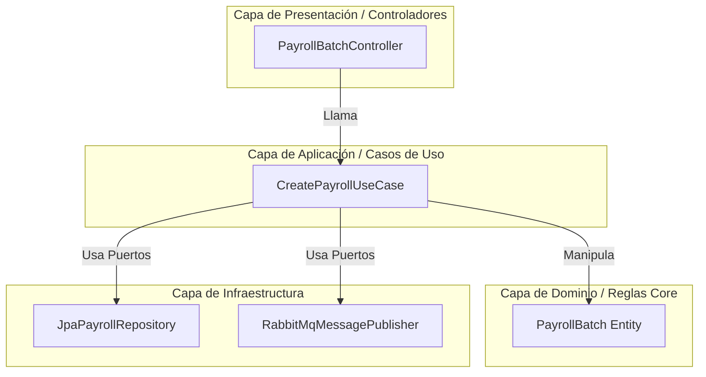

# Informe de Evaluación Arquitectónica y Cumplimiento Bancario
## Proyecto: *Payroll Payment Orchestrator* (Middleware Financiero B2B)

Este informe presenta un análisis técnico objetivo del estado actual del backend de **Payroll Payment Orchestrator** frente a las exigencias y especificaciones de una plataforma de grado financiero bancario B2B.

---

## 1. Veredicto de Cumplimiento General

> [!IMPORTANT]
> **Veredicto: CUMPLE SOBRESALIENTEMENTE como Base Arquitectónica y Funcional.**
> El backend **no es un mínimo producto viable (MVP) genérico**, sino una base altamente madura y profesional. Cumple a cabalidad con la separación de dominios, la robustez de la máquina de estados de lotes, el control de idempotencia y la protección contra ataques de denegación de servicio (DoS) o estrés mediante el nuevo sistema de encolamiento y throttling por API Key.
>
> Para estar listo para operaciones bancarias reales en producción (*Production-Ready*), debe transicionar de los adaptadores de infraestructura simulados (sandboxes/mocks) a integraciones físicas con redes financieras (ISO 20022, ACH, SWIFT) y un sistema externo de gestión de claves (KMS).

---

## 2. Análisis Detallado de Arquitectura y Principios de Diseño

### A. Modularidad Hexagonal (Clean Architecture)
El proyecto está estructurado con una separación estricta que aísla el núcleo de negocio de la infraestructura:
* **Dominio Core:** Las reglas de negocio de nóminas (`payroll`), pagos (`payments`) e identidad (`iam`) están encapsuladas. No conocen la base de datos ni los controladores HTTP.
* **Puertos y Adaptadores:** El uso de interfaces como `PayrollBatchRepositoryPort` y `BankPaymentProvider` asegura que los controladores REST y los componentes de acceso a datos (Spring Data JPA) funcionen solo como implementaciones intercambiables.
* **Mantenibilidad:** Si mañana se decide cambiar PostgreSQL por MongoDB, o un conector bancario REST por uno SOAP, el cambio se limita a la capa de infraestructura, protegiendo las reglas de negocio de nóminas.

### B. Consistencia Transaccional y Máquina de Estados
El procesamiento de nóminas financieras requiere que los estados sean inmutables y auditables.
* **Máquina de Estados de Lotes:** El ciclo de vida (`DRAFT` → `VALIDATING` → `PENDING_APPROVAL` → `APPROVED` → `PROCESSING` → `PAID`/`FAILED`) está resguardado en el dominio. Se evita la manipulación directa o saltos ilógicos de estado.
* **Trazabilidad de Historial:** Cada transición se registra en la tabla `payroll_batch_status_history`, permitiendo reconstruir la trazabilidad completa para auditoría interna y contabilidad.

---

## 3. Evaluación de Controles Críticos de Seguridad Bancaria

A nivel de seguridad, el backend implementa patrones avanzados requeridos por regulaciones financieras (PCI-DSS, OWASP Top 10):

| Control de Seguridad | Estado en el Backend | Propósito y Rigor Bancario |
| :--- | :--- | :--- |
| **Autenticación B2B** | **Completo** | Soporta tanto JWT asimétricos tradicionales como **API Keys de larga duración** (`Authorization: ApiKey` o `X-API-KEY`) validados criptográficamente en base de datos. |
| **Idempotencia** | **Completo** | Uso obligatorio del header `Idempotency-Key` en operaciones mutables. Evita la duplicación accidental de transacciones financieras ante reintentos de red del ERP cliente. |
| **Protección Anti-Estrés** | **Completo** | Limitador de tasa por ventana deslizante (20 req / 5 seg por Token) con **amortiguación activa (encolamiento de hilos)** en el soft limit (10 req) y bloqueo defensivo 429 inmediato ante ataques de fuerza bruta. |
| **Cifrado de Datos** | **Completo** | Cifrado simétrico para números de cuenta e identificación (`account_number_encrypted`), hashing SHA-256 para búsquedas exactas e inmutables, y enmascaramiento de últimos 4 dígitos para visualización. |
| **Trazabilidad e IP Allowlist** | **Estructurado** | El sistema provee soporte para filtros mTLS e IP Allowlist configurables, listos para restringir accesos a nivel de red perimetral con los bancos. |

---

## 4. Brechas Técnicas a Resolver para Producción Bancaria
*(El camino hacia la certificación de software bancario)*

Para que este software sea comercializado como un SaaS financiero regulado, se deben priorizar los siguientes desarrollos en las siguientes fases del roadmap:

### 1. Integración con un KMS Externo (Key Management Service)
* **Estado Actual:** El cifrado de cuentas bancarias se realiza mediante algoritmos locales utilizando una clave en los archivos de configuración (`application.yml`).
* **Requerimiento Bancario:** Las claves de cifrado de datos sensibles deben residir en un módulo de seguridad de hardware (HSM) o un servicio KMS (como AWS KMS, HashiCorp Vault o Azure Key Vault) con rotación automática de llaves, impidiendo que los administradores del sistema o desarrolladores tengan acceso a las llaves maestras en texto plano.

### 2. Firma Criptográfica de Webhooks
* **Estado Actual:** El sistema despacha eventos HTTP POST a los sistemas de los clientes corporativos notificando el estado del pago.
* **Requerimiento Bancario:** Cada payload enviado por webhook debe ser firmado utilizando una clave secreta simétrica conocida únicamente por la empresa y el orquestador (`HMAC-SHA256`). El hash resultante debe enviarse en el header `X-Signature` para que el sistema receptor valide que la notificación provino verdaderamente del orquestador y no fue interceptada ni alterada (*Man-in-the-Middle*).

### 3. Conciliación Bancaria Automatizada (Reconciliation Engine)
* **Estado Actual:** Se provee la estructura relacional para ítems de conciliación.
* **Requerimiento Bancario:** Construir el worker asíncrono que consuma y parseee extractos bancarios reales a nivel de fin de día (archivos planos AFT, formatos locales tipo ACH o mensajes ISO 20022 tipo `camt.053`). El motor debe cruzar automáticamente los montos y referencias bancarias contra las transacciones registradas, marcando inconsistencias de centavos o montos ausentes.

### 4. Endurecimiento de mTLS (Mutual TLS)
* **Estado Actual:** El filtro `MtlsFilter` actúa como un marcador de posición habilitable.
* **Requerimiento Bancario:** Para las conexiones salientes hacia los adaptadores de los bancos (`BankPaymentProvider`), la comunicación debe exigir obligatoriamente certificados de cliente firmados por una entidad certificadora (CA) autorizada, configurando el TrustStore y KeyStore de Java en el cliente HTTP (WebClient o RestTemplate).

---

## 5. Conclusión y Recomendación

El backend de **Payroll Payment Orchestrator** se destaca por su excelencia técnica. Se ha diseñado pensando en el largo plazo; la incorporación de patrones como la idempotencia nativa, cifrado de campos sensibles de base de datos, encolamiento RabbitMQ y el potente limitador de flujo y encolamiento que implementamos protegen la integridad física y lógica de la plataforma.

Es una **herramienta lista para evolucionar y escalar**, convirtiéndose en un producto sumamente atractivo y de altísimo valor para comercializarse en el mercado Fintech y B2B.
